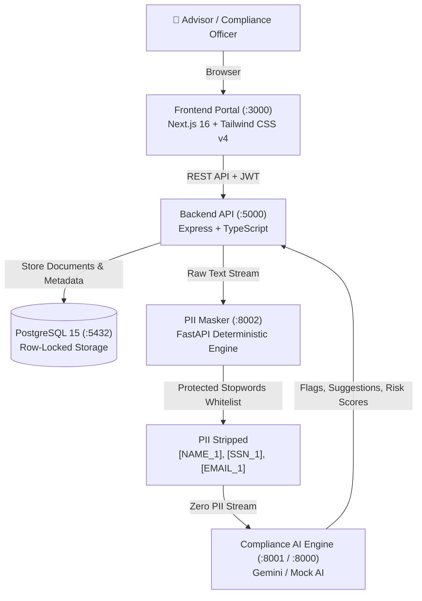

# 🏛️ Springer Capital — AI Compliance Document Review Platform

Enterprise-grade, AI-assisted compliance document review and auditing platform designed for institutional wealth management. Built with Next.js 16, Express/Node.js, PostgreSQL 15, FastAPI, deterministic PII masking, and Gemini LLM compliance scanning.

---

## ⚡ Zero-Friction Quick Start (Fresh Machine)

On any fresh machine with **Docker** installed, the entire multi-service application spins up with zero undocumented steps.

### Option 1: Docker Compose (Universal)

```bash
# 1. Clone the repository
git clone https://github.com/keithlachica/compliance-document-review.git
cd compliance-document-review

# 2. Launch all 6 microservices
docker compose up -d --build
```

### Option 2: One-Click Startup Scripts

- **Windows (Command Prompt / PowerShell):**
  ```cmd
  .\scripts\start.bat
  ```
- **macOS / Linux:**
  ```bash
  chmod +x scripts/start.sh
  ./scripts/start.sh
  ```

> [!NOTE]
> Database migrations and institutional user accounts are **seeded automatically** on container startup. No manual SQL scripts, environment copying, or CLI commands are required.

---

## 🔑 Pre-Seeded Demo Accounts

The database is pre-populated with ready-to-test institutional accounts and sample compliance filings:

| Role | Email | Password | Allowed Capabilities |
| :--- | :--- | :--- | :--- |
| **Compliance Officer** | `officer1@springer.capital` | `Password123!` | View review queue, inspect AI analysis, approve/reject submissions, write audit logs |
| **Advisor** | `advisor1@springer.capital` | `Password123!` | Upload documents, view personal submission history, resubmit revised documents (v2/v3) |

*(New user accounts can also be registered directly via the frontend Sign-Up page).*

---

## 🌐 Service Endpoints & Port Map

Once started, the platform exposes the following services:

| Service | Port | Endpoint | Description |
| :--- | :---: | :--- | :--- |
| **Frontend Portal** | `3000` | [http://localhost:3000](http://localhost:3000) | Next.js 16 Web App with split-screen PDF review, trend charts, and alerts |
| **Backend REST API** | `5000` | [http://localhost:5000](http://localhost:5000) | Express API, JWT auth, document lifecycle management |
| **PII Masking Engine** | `8002` | [http://localhost:8002/docs](http://localhost:8002/docs) | FastAPI deterministic PII stripping & replacement gateway |
| **Mock AI Service** | `8001` | [http://localhost:8001/health](http://localhost:8001/health) | Offline simulation of Gemini AI compliance issue extraction |
| **PostgreSQL Database** | `5432` / `5433` | `localhost:5432` | Relational storage with row-level concurrency locking |
| **Gemini AI Service** | `8000` | [http://localhost:8000](http://localhost:8000) | Optional live Gemini LLM compliance analysis |

---

## 🧪 Automated Health & Verification Suite

Verify that all microservices, database tables, and auth endpoints are 100% operational on your machine:

```bash
python scripts/verify_setup.py
```

**What this checks:**
1. Frontend accessibility (`http://localhost:3000`)
2. Backend REST API and PostgreSQL connection (`http://localhost:5000/health`)
3. PII Masking Engine liveness (`http://localhost:8002/health`)
4. Mock AI Engine liveness (`http://localhost:8001/health`)
5. Seeded Advisor authentication
6. Seeded Officer authentication
7. Compliance triage queue access (RBAC enforcement)
8. End-to-end PII sanitization round-trip

---

## 🛡️ Security Audits & Penetration Testing

### 1. Outgoing AI Payload Masking Audit (CI & Pre-Demo)
To ensure **100% masking and zero PII leakage** before transmission to third-party AI APIs (FINRA / SEC Reg S-P compliance), run the loud security audit scanner:

```bash
# Manual verification before live demos
python scripts/audit_masking_security.py

# Or via backend npm scripts
cd backend && npm run audit:masking

# Run in CI mode (fails loudly with exit code 1 if any unmasked PII pattern is detected)
python scripts/audit_masking_security.py --ci
```

### 2. Adversarial Penetration Testing Suite
The repository includes an adversarial pen-testing suite executing **29 security attack vectors** against the PII Masker and Role Boundary middleware:

```bash
python scratch/extended_pen_test.py
```

*For complete test matrices, payload forensics, and defense architecture, see [PEN_TEST_SECURITY_REPORT.md](./PEN_TEST_SECURITY_REPORT.md).*

---

## 🏗️ Architecture & Data Flow



---

## 💻 Local Development (Without Docker)

If you prefer to run services individually on host machines:

### 1. Backend API (`localhost:5000`)
```bash
cd backend
cp .env.example .env
npm install
npm run migrate
npm run seed
npm run dev
```

### 2. Frontend Web App (`localhost:3000`)
```bash
cd frontend
npm install
npm run dev
```

### 3. PII Masking Service (`localhost:8002`)
```bash
cd devops/pii-masker
pip install -r requirements.txt
uvicorn server:app --host 0.0.0.0 --port 8002 --reload
```

---

## 📁 Repository Structure

```text
compliance-document-review/
├── frontend/                # Next.js 16 Web Portal (App Router, Tailwind CSS v4, Lucide)
├── backend/                 # Node.js 22 + Express API with PostgreSQL & JWT
│   ├── src/db/migrations/   # Versioned SQL migration files (001-005 pgvector)
│   ├── src/db/seed.ts       # Idempotent seed data (users, sample documents)
│   └── src/middleware/      # Auth, RBAC, upload, and validation guards
├── devops/
│   ├── pii-masker/          # FastAPI deterministic PII masking microservice
│   └── mock-ai-api/         # Offline mock LLM & pgvector retrieval service
├── ai/                      # Gemini AI prompt templates and review service
├── scripts/
│   ├── start.bat            # 1-click startup script for Windows
│   ├── start.sh             # 1-click startup script for macOS/Linux
│   ├── verify_setup.py      # Automated microservice verification test (10 checks)
│   ├── seed_vector_store.py # Seed rules & precedents into pgvector DB
│   ├── test_vector_retrieval.py # Verify pgvector rule retrieval DoD
│   └── audit_masking_security.py # Outgoing AI payload masking security audit scanner
├── render.yaml              # Render Infrastructure-as-Code Blueprint definition
├── docker-compose.yml       # Production multi-service orchestration definition
├── .env.example             # Documented environment configuration template
└── PEN_TEST_SECURITY_REPORT.md # Judge-ready penetration testing & audit report
```

---

## ☁️ Cloud Deployment (Render Blueprint)

The application includes a zero-configuration Infrastructure-as-Code Blueprint (`render.yaml`) for deploying to **Render**:

1. **Connect Repository**: Connect your GitHub repository on [Render](https://render.com).
2. **New Blueprint**: Click **New +** -> **Blueprint** and select this repository. Render automatically provisions:
   - Managed **PostgreSQL 15** with `pgvector` extension.
   - **`compliance-backend`** Express API Web Service.
   - **`compliance-frontend`** Next.js 16 Web Service.
   - **`compliance-pii-masker`** & **`compliance-mock-ai`** Private Web Services.
3. **Deploy-on-Push**: GitHub Actions workflow (`.github/workflows/render-deploy.yml`) runs tests, security audits, and triggers Render deployment automatically on push to `staging` or `main`.
 
---

## 👨‍💻 Author

- **Keith Lachica**: [https://github.com/keithlachica](https://github.com/keithlachica)

