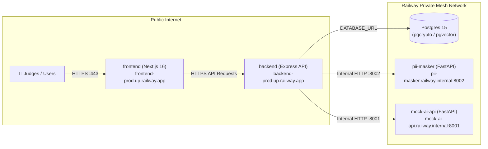

# 🚀 Railway Production & Live Demo Deployment Guide
**Platform:** Springer Capital — AI Compliance Document Review System  
**Target:** [Railway](https://railway.com) (Single unified project with private networking)  
**Deployment Model:** Monorepo with Multi-Service Container Orchestration & Continuous Deploy-on-Push  

---

## 1. Why Railway for Live Hackathon Judging?

| Criteria | Railway | Render (Free Tier) | Vercel + Separate DB |
| :--- | :---: | :---: | :---: |
| **Cold-Start Latency** | **0s (Always Warm)**<br>`sleepApplication: false` | 30s–50s spin-down lag | Fast frontend, but serverless DB connection spikes |
| **All Services in 1 Project** | **Yes** (Frontend, Backend, DB, PII Masker, AI) | Split across services | Split across multiple vendors |
| **Private DNS Networking** | **Yes** (`*.railway.internal`) | Complex external routing | Exposed public endpoints |
| **PostgreSQL + Extensions** | **Native** (`pgcrypto`, `pgvector`) | Limited | Requires external Supabase/Neon |
| **Deploy on Git Push** | **Instant rolling update** | Slow queue | Fast, but fragmented |

---

## 2. Project Architecture Topology on Railway

In Railway, create **one single project** named `springer-capital-compliance`. Inside this project, provision the following 5 interconnected services:



---

## 3. Step-by-Step 3-Minute Setup on Railway

### Step 1: Create Railway Project
1. Log in to [Railway.app](https://railway.com).
2. Click **New Project** > **Provision PostgreSQL**.
   - Railway will create your database service with connection credentials (`DATABASE_URL`).

### Step 2: Add Backend Service
1. In the same project canvas, click **New** > **GitHub Repo** > Select `compliance-document-review`.
2. Click the newly added service card > **Settings**:
   - **Service Name:** `backend`
   - **Root Directory:** `/backend`
   - **Build:** Automatically detects `Dockerfile` (or `backend/railway.json`).
3. Under **Networking**, click **Generate Domain** (e.g. `https://backend-production-xxxx.up.railway.app`).
4. Go to **Variables** and add:
   ```env
   NODE_ENV=production
   PORT=5000
   DATABASE_URL=${{ Postgres.DATABASE_URL }}
   DB_SSL=true
   JWT_SECRET=super-secret-compliance-jwt-key-change-in-production-2026!
   JWT_EXPIRES_IN=7d
   UPLOAD_DIR=uploads/documents
   MAX_FILE_SIZE_MB=25
   CORS_ORIGIN=*
   PII_MASKER_URL=http://pii-masker.railway.internal:8002
   RETRIEVAL_SERVICE_URL=http://mock-ai-api.railway.internal:8001
   ```

### Step 3: Add PII Masker Service
1. Click **New** > **GitHub Repo** > Select `compliance-document-review`.
2. Click service card > **Settings**:
   - **Service Name:** `pii-masker`
   - **Root Directory:** `/devops/pii-masker`
3. Under **Networking**, click **Enable Private Networking** (Service will be accessible at `http://pii-masker.railway.internal:8002`).
4. Go to **Variables**:
   ```env
   PORT=8002
   ```

### Step 4: Add Mock AI Service
1. Click **New** > **GitHub Repo** > Select `compliance-document-review`.
2. Click service card > **Settings**:
   - **Service Name:** `mock-ai-api`
   - **Root Directory:** `/devops/mock-ai-api`
3. Under **Networking**, click **Enable Private Networking** (`http://mock-ai-api.railway.internal:8001`).
4. Go to **Variables**:
   ```env
   PORT=8001
   ```

### Step 5: Add Frontend Web App
1. Click **New** > **GitHub Repo** > Select `compliance-document-review`.
2. Click service card > **Settings**:
   - **Service Name:** `frontend`
   - **Root Directory:** `/frontend`
3. Under **Networking**, click **Generate Domain** (e.g. `https://frontend-production-xxxx.up.railway.app`).
4. Go to **Variables**:
   ```env
   NODE_ENV=production
   NEXT_TELEMETRY_DISABLED=1
   NEXT_PUBLIC_API_URL=https://backend-production-xxxx.up.railway.app
   ```
   *(Replace with the actual public URL generated for your Backend service).*

---

## 4. Deploy-on-Push Continuous Delivery

### Mode A: Native Railway GitHub Integration (Zero-Config)
Railway automatically connects to your GitHub repository and triggers zero-downtime rolling builds on every push to `staging` or `main`.

### Mode B: GitHub Actions Quality-Gated Pipeline
The repository includes `.github/workflows/deploy.yml`:
1. Runs full backend test suites, database migrations, and TypeScript compilation.
2. Runs frontend lint and production build checks.
3. Automatically triggers Railway rolling deployment once all checks pass.

To enable the GitHub Action trigger:
1. In Railway: Go to **Project Settings** > **Tokens** > Click **Create Token**.
2. In GitHub: Go to your repository > **Settings** > **Secrets and variables** > **Actions** > **New repository secret**.
3. Name: `RAILWAY_TOKEN`, Value: paste your Railway Project Token.

---

## 5. Live Demo Verification & Health Checklist

Once deployed on Railway, verify the live demo endpoints:

```bash
# 1. Health check backend & database
curl https://<your-backend-domain>/health

# 2. Test login as demo Advisor
curl -X POST https://<your-backend-domain>/auth/login \
  -H "Content-Type: application/json" \
  -d '{"email":"advisor1@springer.capital","password":"Password123!"}'

# 3. Test login as demo Officer
curl -X POST https://<your-backend-domain>/auth/login \
  -H "Content-Type: application/json" \
  -d '{"email":"officer1@springer.capital","password":"Password123!"}'

# 4. Open frontend in browser
open https://<your-frontend-domain>
```
