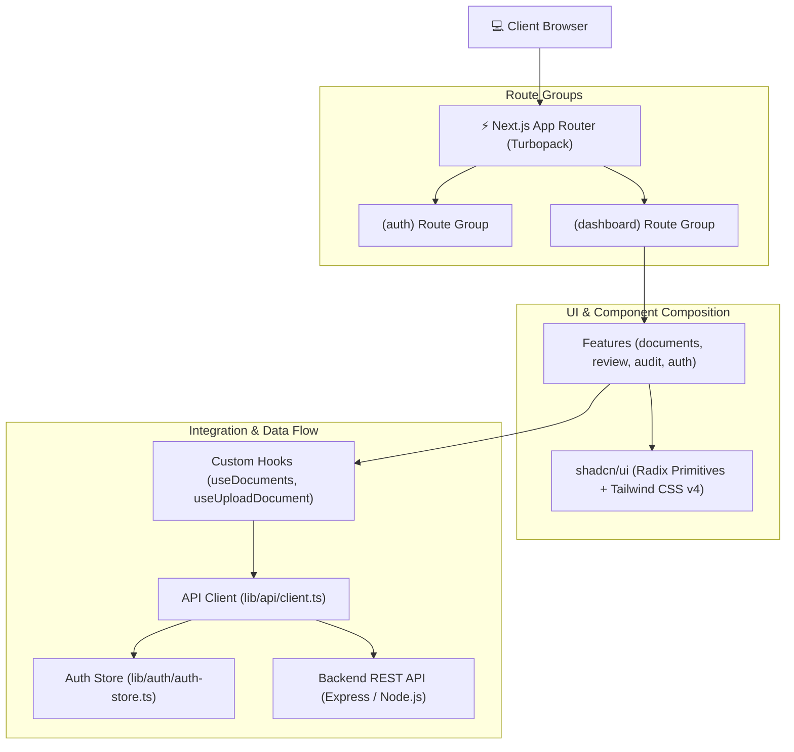
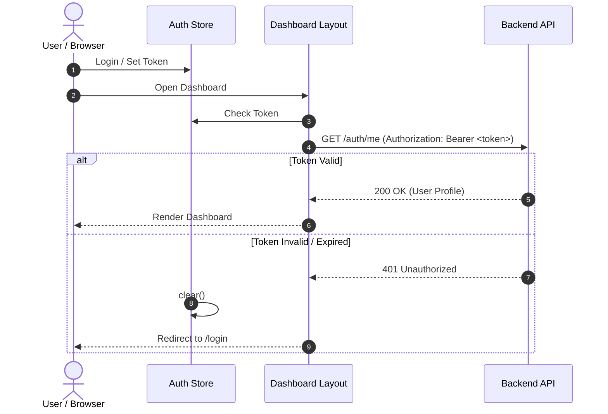

# 🏛️ Springer Capital — Frontend Architecture Specification

This document details the architectural blueprint, design system, data flow, security model, and component conventions for the **Springer Capital Web Platform**.

---

## 📑 Table of Contents
1. [Architecture Blueprint](#-architecture-blueprint)
2. [Technology Stack](#-technology-stack)
3. [App Router & Route Layouts](#-app-router--route-layouts)
4. [Component & Design System (shadcn/ui + Tailwind v4)](#-component--design-system-shadcnui--tailwind-v4)
5. [Authentication & Session Flow](#-authentication--session-flow)
6. [API Layer & Error Handling](#-api-layer--error-handling)
7. [Validation & Type Contracts](#-validation--type-contracts)
8. [Feature Addition Guide](#-feature-addition-guide)
9. [Contributors](#-contributors)

---

## 🏛️ Architecture Blueprint

---

## 🛠️ Technology Stack

| Layer | Library / Tool | Description |
| :--- | :--- | :--- |
| **Framework** | Next.js 16 (App Router) | High-performance React framework with Turbopack |
| **UI Engine** | React 19 | Latest React with Server/Client components |
| **Design System** | shadcn/ui + Radix UI | Headless, accessible primitives styled with Tailwind CSS |
| **Styling** | Tailwind CSS v4 | CSS variables and `@theme` token configuration |
| **Validation** | Zod 4 | Runtime input and schema validation |
| **HTTP Client** | Native Fetch Wrapper | Typed requests with automatic Bearer token injection |
| **Language** | TypeScript 5 | End-to-end type safety |

---

## 📂 App Router & Route Layouts

The application employs Next.js Route Groups `(auth)` and `(dashboard)` for clean layout boundaries:

- **`(auth)` Layout**: Centered card layout with Springer Capital branding for `/login` and `/signup`.
- **`(dashboard)` Layout**: Master layout including Topbar Header, Navigation Sidebar, Role Context, and Session Guard.
  - `/queue`: Officer document compliance queue.
  - `/submissions`: Advisor document submission list and upload trigger.
  - `/documents/[id]`: Multi-pane document detail and review workstation.

---

## 🧩 Component & Design System (shadcn/ui + Tailwind v4)

All primitives in `src/components/ui/` adhere to **shadcn/ui** patterns:
- Styled with Tailwind CSS v4 utility classes.
- Combined using the `cn()` helper (`clsx` + `tailwind-merge`).
- Full accessibility support (ARIA attributes, keyboard navigation, focus trap).

### Design Tokens (`src/app/globals.css`):
- `--primary`: Deep Navy (`hsl(222, 47%, 20%)`)
- `--secondary`: Slate Muted (`hsl(215, 16%, 47%)`)
- `--success`: Emerald Green (`hsl(142, 71%, 45%)`)
- `--warning`: Amber Orange (`hsl(38, 92%, 50%)`)
- `--destructive`: Crimson Red (`hsl(0, 84%, 60%)`)

---

## 🔒 Authentication & Session Flow

---

## 🌐 API Layer & Error Handling

Centralized in `src/lib/api/client.ts`:
- **Bearer Token Injection**: Automatically pulls the current token from `authStore.getToken()`.
- **Multipart Form Data**: Automatically handles `FormData` payload uploads.
- **Normalized Errors**: Throws structured `ApiError` instances containing HTTP status and server error messages.

---

## 📝 Validation & Type Contracts

- **Validation Schemas (`src/lib/validation/`)**: Runtime schema validation via Zod for forms and payloads.
- **TypeScript Types (`src/types/`)**: Shared interfaces and type definitions across the frontend.

---

## 👥 Contributors

- **Engineering Team**: **SPRINGER CAPITAL INTERN**
- **Architecture**: Next.js 16 (App Router) + React 19 + Tailwind CSS v4 + shadcn/ui + TypeScript 5
