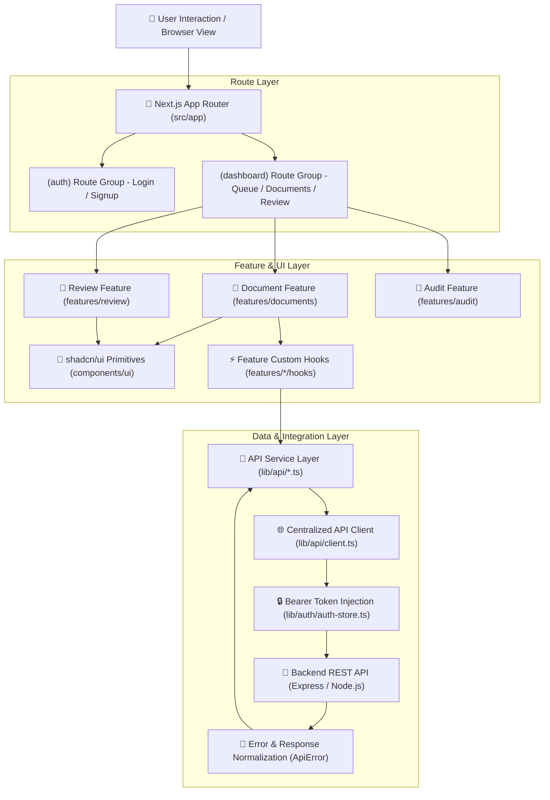
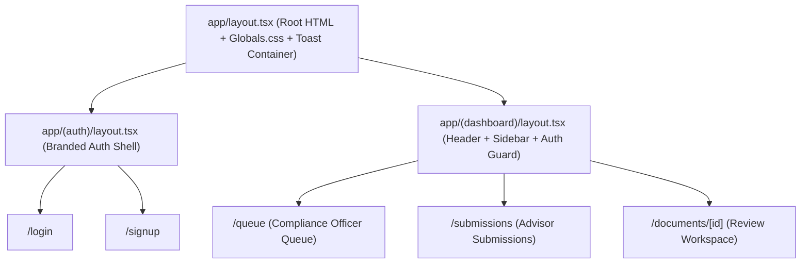
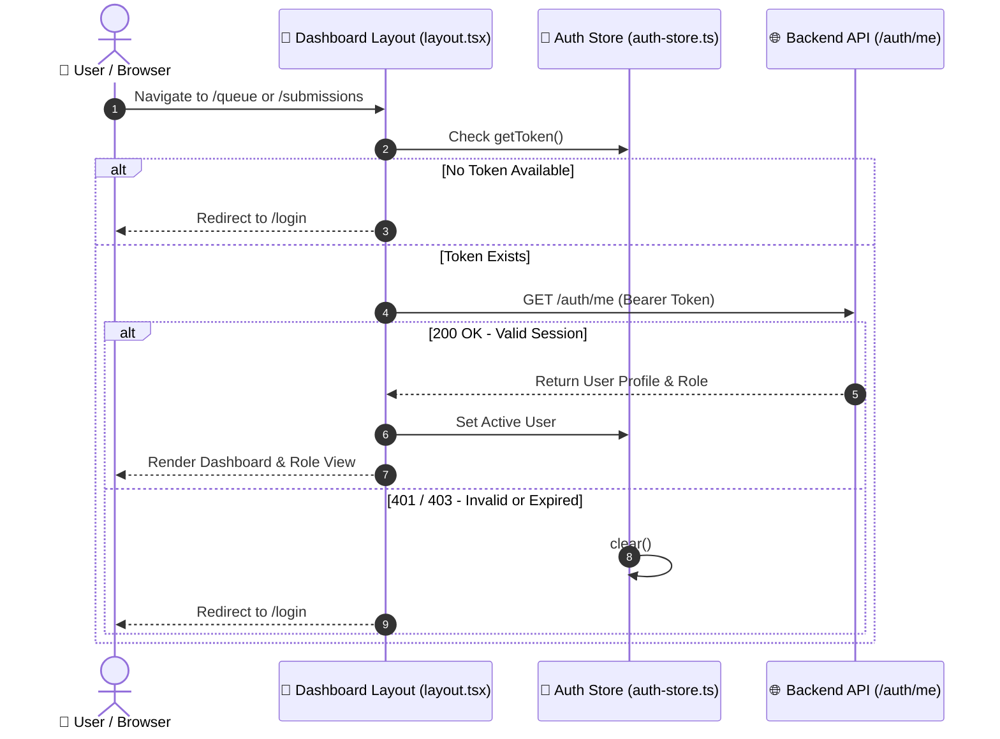
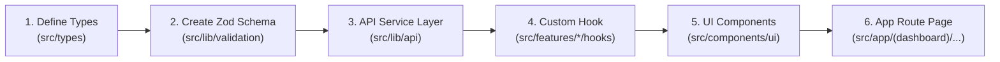
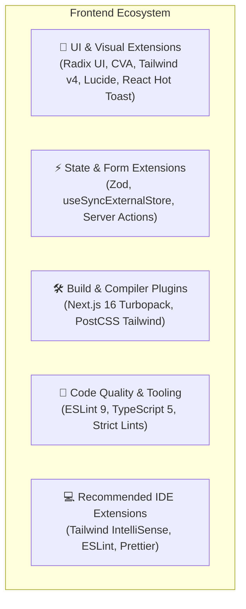

# 🏛️ Springer Capital — Frontend Architecture & Developer Guide

This document provides a comprehensive technical overview of the architecture, design patterns, directory structure, data flow, component system, and development workflows for the **Springer Capital Document Compliance & Review Web Platform**.

> **Last Updated:** September 8, 2026 — Chatbot typing animation, UI color system standardization (`#24A152` / `#062A20`), and TypeScript interface updates.

---

## 📑 Table of Contents
1. [System Overview](#-system-overview)
2. [Technology Stack](#-technology-stack)
3. [Architecture Overview](#-architecture-overview)
4. [Directory & Layer Structure](#-directory--layer-structure)
5. [Key Architectural Subsystems](#-key-architectural-subsystems)
   - [1. Routing & Layout Hierarchy (App Router)](#1-routing--layout-hierarchy-app-router)
   - [2. Route Protection & Auth Lifecycle](#2-route-protection--auth-lifecycle)
   - [3. API Communication & Error Handling](#3-api-communication--error-handling)
   - [4. State Management Strategy](#4-state-management-strategy)
   - [5. Schema Validation & Form Management (shadcn/ui + Zod)](#5-schema-validation--form-management-shadcnui--zod)
   - [6. Component & UI Architecture (shadcn/ui & Tailwind CSS v4)](#6-component--ui-architecture-shadcnui--tailwind-css-v4)
   - [7. Backend API Connection & Integration](#7-backend-api-connection--integration)
   - [8. AI Compliance Chatbot & Typing Animation](#8-ai-compliance-chatbot--typing-animation)
6. [UI Design System & Brand Tokens](#-ui-design-system--brand-tokens)
7. [Environment Configuration](#-environment-configuration)
8. [Development & Build Scripts](#-development--build-scripts)
9. [Feature Addition Workflow & Best Practices](#-feature-addition-workflow--best-practices)
10. [Extensions, Plugins & Developer Tooling Ecosystem](#-extensions-plugins--developer-tooling-ecosystem)
11. [Contributors & Maintainers](#-contributors--maintainers)

---

## 🌟 System Overview

The **Springer Capital Frontend Portal** is an enterprise-grade document compliance, auditing, and review platform built with **Next.js 16 (App Router)**, **React 19**, **Tailwind CSS v4**, and **shadcn/ui**. It delivers high-performance, role-tailored workflows for **Advisors** and **Compliance Officers** to process, review, annotate, and approve compliance documentation.

### Core Business Domains:
- **Authentication & Sessions**: Role-based access control (Advisors vs. Compliance Officers), registration, login, and in-memory session token handling with `/auth/me` validation.
- **Document Queue Management**: Filterable queues, tabbed navigation (`Pending`, `Approved`, `Needs Revision`, `Rejected`), real-time status badges, and search filtering.
- **Advisor Submissions**: Document upload workflows with client-side Zod validation, file drag-and-drop, metadata capture, and document revision tracking.
- **Compliance Review Workspace**: Multi-pane document inspector, split-screen PDF preview, flagged compliance risk cards, audit checklists, and formal decision actions (Approve, Reject, Request Revision).
- **AI-Assisted Compliance**: AI Assist panel offering automated policy scanning, risk scoring, extraction summaries, and real-time contextual suggestions.
- **Audit Logging**: Comprehensive chronological audit timeline tracking every document state transition and reviewer comment.

---

## 🛠️ Technology Stack

| Layer / Concern | Technology | Version | Purpose |
| :--- | :--- | :--- | :--- |
| **Framework** | [Next.js](https://nextjs.org/) (App Router with Turbopack) | `v16.3.x` | Hybrid SSR/Client rendering, Server Components, Route Groups |
| **Core UI Library** | [React](https://react.dev/) | `v19.2.x` | Reactive UI engine with Server/Client component paradigms |
| **Language** | [TypeScript](https://www.typescriptlang.org/) | `v5.x` | Strict type safety, domain interfaces, and compile-time validation |
| **Component System** | [shadcn/ui](https://ui.shadcn.com/) (Radix UI Primitives) | Latest | Accessible, customizable component primitives with full keyboard navigation |
| **Styling & CSS** | [Tailwind CSS](https://tailwindcss.com/) + `@tailwindcss/postcss` | `v4.x` | Modern utility-first CSS engine with CSS variables & `@theme` design tokens |
| **Class Merging** | `clsx` + `tailwind-merge` (`cn` helper) | Latest | Safe, dynamic class composition and collision resolution |
| **Schema Validation**| [Zod](https://zod.dev/) | `v4.x` | Declarative runtime validation schemas for forms, file uploads, and API contracts |
| **Icons & Media** | [Lucide React](https://lucide.dev/) | `v1.39.x` | Scalable, accessible SVG iconography |
| **State & Auth Store** | Client Store (`authStore`) + React Hooks | Custom | Lightweight session management with Bearer token persistence |
| **HTTP Client** | Centralized Fetch Client (`lib/api/client.ts`) | Native Fetch | Typed API requests, dynamic Bearer injection, and `ApiError` normalization |
| **Build & Bundler** | Turbopack / Next Compiler | `v16.x` | Sub-second HMR dev server and optimized production builds |

---

## 🏗️ Architecture Overview

The frontend follows a **Layered, Feature-Driven Architecture** separating UI primitives, feature business logic, API communication, and route pages:



---

## 📁 Directory & Layer Structure

The project code is organized in `frontend/src/` with clear boundaries between reusable UI, feature modules, and core utilities:

```
frontend/
├── src/
│   ├── app/                              # Next.js App Router (Pages, Layouts & Route Groups)
│   │   ├── (auth)/                       # Public Authentication Route Group
│   │   │   ├── layout.tsx                # Centered, branded split-card layout
│   │   │   ├── login/page.tsx            # Login screen (Advisor & Officer login)
│   │   │   └── signup/page.tsx           # Registration screen with role selection
│   │   │
│   │   ├── (dashboard)/                  # Protected Application Route Group
│   │   │   ├── layout.tsx                # Master dashboard shell (Navbar + Sidebar + Role context)
│   │   │   ├── queue/page.tsx            # Compliance Officer review queue
│   │   │   ├── submissions/page.tsx      # Advisor document submissions & upload screen
│   │   │   └── documents/
│   │   │       └── [id]/page.tsx         # Detailed document review workspace & timeline
│   │   │
│   │   ├── favicon.ico
│   │   ├── globals.css                   # Tailwind CSS v4 theme variables & tokens
│   │   ├── icon.svg                      # Platform favicon SVG
│   │   ├── layout.tsx                    # Root HTML layout (Fonts, Metadata, Shell)
│   │   └── page.tsx                      # Root index redirect (routes to /login or /queue)
│   │
│   ├── components/                       # Shared & Reusable UI Layer
│   │   ├── layout/                       # Layout structural components
│   │   ├── layouts/                      # Header, Navbar, Sidebar wrappers
│   │   │   ├── header.tsx                # App Topbar with user profile & role badge
│   │   │   ├── navbar.tsx                # Navigation bar component
│   │   │   └── sidebar.tsx               # Collapsible navigation drawer
│   │   ├── shared/                       # Cross-domain shared UI components
│   │   └── ui/                           # shadcn/ui Component Primitives (Accessible Radix wrappers)
│   │       ├── alert.tsx                 # Alert feedback banners
│   │       ├── badge.tsx                 # Status indicator badges
│   │       ├── button.tsx                # Button variants (default, outline, destructive, ghost)
│   │       ├── card.tsx                  # Content cards & headers
│   │       ├── chatbot-widget.tsx        # Floating AI assistant widget (with typing animation)
│   │       ├── data-table.tsx            # Generic tabular data grid
│   │       ├── dialog.tsx                # Accessible modal dialogs
│   │       ├── dropdown-menu.tsx         # Action & profile dropdown menus
│   │       ├── input.tsx                 # Form input fields
│   │       ├── popover.tsx               # Floating popover triggers
│   │       ├── progress.tsx              # Progress bar indicator
│   │       ├── radio-group.tsx           # Radio group selector
│   │       ├── select.tsx                # Dropdown selector
│   │       ├── skeleton.tsx              # Skeleton loading placeholders
│   │       ├── table.tsx                 # HTML5 accessible table primitives
│   │       ├── tabs.tsx                  # Tab navigation headers & content panels
│   │       └── textarea.tsx              # Multiline text input
│   │
│   ├── features/                         # Feature-Driven Business Modules
│   │   ├── audit/                        # Audit trail & timeline
│   │   │   └── components/               # Timeline items & change logs
│   │   │
│   │   ├── auth/                         # Authentication Feature
│   │   │   ├── components/               # LoginForm, SignupForm, RoleSelector
│   │   │   └── hooks/                    # useAuth, useSession hooks
│   │   │
│   │   ├── documents/                    # Document Management Feature
│   │   │   ├── components/
│   │   │   │   ├── ai-assist-panel.tsx   # AI compliance suggestion panel
│   │   │   │   ├── document-queue-table.tsx # Officer queue table with filters
│   │   │   │   ├── my-documents-table.tsx   # Advisor submission list
│   │   │   │   ├── upload-document-modal.tsx# Document upload dialog with Zod validation
│   │   │   │   ├── edit-document-modal.tsx  # Document metadata editor
│   │   │   │   ├── revision-timeline.tsx    # Version history & comment thread
│   │   │   │   └── document-detail-placeholder.tsx # Split preview placeholder
│   │   │   └── hooks/
│   │   │       ├── use-documents.ts      # Fetch & filter documents hook
│   │   │       └── use-upload-document.ts# Document upload mutation hook
│   │   │
│   │   └── review/                       # Compliance Review Feature
│   │       └── components/
│   │           ├── compliance-flag-card.tsx # Risk assessment & flag cards
│   │           ├── decision-dialog.tsx      # Approve / Reject / Revise decision modal
│   │           └── review-workspace.tsx     # Full-featured review workstation
│   │
│   ├── lib/                              # Core Utilities, Services & Configuration
│   │   ├── actions/                      # Orchestration & server-client actions
│   │   ├── api/                          # HTTP client & endpoint service definitions
│   │   │   ├── client.ts                 # Centralized fetch wrapper & ApiError
│   │   │   ├── auth.ts                   # Auth API endpoints (login, signup, getMe)
│   │   │   └── documents.ts              # Document CRUD & review API endpoints
│   │   ├── auth/                         # Session & auth store
│   │   │   └── auth-store.ts             # In-memory auth state & token manager
│   │   ├── constants/                    # Application constants & navigation schemas
│   │   ├── validation/                   # Zod validation schemas
│   │   │   ├── auth.schema.ts            # Login & signup schemas
│   │   │   └── document.schema.ts        # Document metadata & upload schemas
│   │   └── utils.ts                      # Class merge utility (cn = clsx + twMerge)
│   │
│   ├── styles/                           # Global token definitions & design assets
│   │   └── tokens.ts                     # Springer brand palette constants (SPRINGER_EMERALD, etc.)
│   └── types/                            # Global TypeScript contracts
│       ├── auth.types.ts                 # User, Role, AuthState, Session contracts
│       └── chatbot.types.ts              # AI Assistant chat message contracts (incl. isTyping field)
│
├── .env.example                          # Environment template
├── .env.local                            # Local environment variables
├── components.json                       # shadcn/ui configuration
├── next.config.ts                        # Next.js configuration
├── package.json                          # Dependencies and scripts
├── postcss.config.mjs                    # PostCSS / Tailwind CSS configuration
└── tsconfig.json                         # TypeScript path aliases (@/* -> ./src/*)
```

---

## 🔒 Key Architectural Subsystems

### 1. Routing & Layout Hierarchy (App Router)

The application leverages **Next.js Route Groups** to separate authenticated and public layout trees without altering URL paths:



---

### 2. Route Protection & Auth Lifecycle

1. **Client Auth Store (`src/lib/auth/auth-store.ts`)**:
   - Manages the active session token in-memory with optional persistent storage.
   - Provides helper methods `getToken()`, `setToken()`, `getUser()`, and `clear()`.
2. **Session Verification**:
   - On initial dashboard load, the client validates the session by querying `GET /auth/me`.
   - If unauthorized or expired, the user is redirected to `/login`.
3. **Role-Based Views**:
   - **Advisor**: Routed to `/submissions` with capabilities to upload, view feedback, and submit revisions.
   - **Compliance Officer**: Routed to `/queue` with capabilities to inspect documents, evaluate compliance flags, and record decisions.



---

### 3. API Communication & Error Handling

All backend communication is routed through `src/lib/api/client.ts`:

- **Automatic Bearer Injection**: Queries `authStore.getToken()` and attaches `Authorization: Bearer <token>` to all authenticated requests.
- **Form-Data Awareness**: Automatically handles `multipart/form-data` uploads without forcing incorrect `Content-Type` headers, allowing the browser to set multipart boundaries properly.
- **Custom `ApiError` Class**: Standardizes API error handling across status codes (`400`, `401`, `403`, `404`, `500`) and extracts JSON error messages gracefully.

```typescript
// Example: src/lib/api/client.ts pattern
export class ApiError extends Error {
  constructor(public status: number, message: string, public data?: unknown) {
    super(message);
    this.name = "ApiError";
  }
}
```

---

### 4. State Management Strategy

| State Type | Mechanism | Location / Example |
| :--- | :--- | :--- |
| **Session & Auth** | In-memory `authStore` + Session validation | `src/lib/auth/auth-store.ts` (Bearer token, role, user info) |
| **Document Data** | Custom React hooks with async fetch lifecycle | `src/features/documents/hooks/use-documents.ts` |
| **Form State** | `react-hook-form` + `zod` | Modals, login forms, document upload forms |
| **URL Filter State** | Next.js `useSearchParams` / URL query params | Queue status tabs (`?status=pending`), search queries |
| **UI & Modal State** | React `useState` & Radix Dialog state | Upload modal open/close, active preview panel toggle |

---

### 5. Schema Validation & Form Management (shadcn/ui + Zod)

Forms and API payloads are strictly validated using **Zod** schemas in `src/lib/validation/`:

- **`auth.schema.ts`**: Validates email format, password complexity, role selection, and matching passwords.
- **`document.schema.ts`**: Validates document title, category, file size, accepted MIME types (PDF, DOCX, PNG), and compliance tags.

```typescript
// Example: Document Upload Validation Schema
import { z } from "zod";

export const uploadDocumentSchema = z.object({
  title: z.string().min(3, "Title must be at least 3 characters"),
  category: z.enum(["FINANCIAL_REPORT", "COMPLIANCE_DISCLOSURE", "KYC_VERIFICATION", "AUDIT_MEMO"]),
  notes: z.string().optional(),
  file: z
    .custom<File>((val) => val instanceof File, "Document file is required")
    .refine((file) => file.size <= 15 * 1024 * 1024, "File size must be under 15MB"),
});

export type UploadDocumentInput = z.infer<typeof uploadDocumentSchema>;
```

---

### 6. Component & UI Architecture (shadcn/ui & Tailwind CSS v4)

1. **shadcn/ui Primitives (`src/components/ui/`)**:
   - Built on top of headless Radix UI components for full WAI-ARIA accessibility.
   - Customized using Tailwind CSS v4 design tokens via the `cn(...)` utility (`clsx` + `tailwind-merge`).
2. **Design Tokens (`src/app/globals.css`)**:
   - Premium corporate palette designed for financial compliance and high legibility:
     - `--primary`: Springer Emerald (`#24A152`) — all primary buttons and interactive accents
     - `--primary-hover`: Deep Forest (`#062A20`) — all hover states across the entire UI
     - `--secondary`: Slate Muted — table filters, outline buttons, ghost controls
     - `--destructive`: Crimson Red (`hsl(0, 84%, 60%)`) — destructive/delete actions
3. **Micro-Interactions**:
   - Smooth focus rings, clean modal transitions, interactive badge hover states, and responsive data tables.
   - **Chatbot typing animation** with character-by-character reveal, blinking cursor, and 3-dot bounce indicator.

---

### 7. Backend API Connection & Integration

The frontend connects directly to the backend REST API configured via `NEXT_PUBLIC_API_URL`:

- **Health Endpoint**: `GET /health`
- **Auth Routes**:
  - `POST /auth/login` — User authentication
  - `POST /auth/signup` — Account registration
  - `GET /auth/me` — Current authenticated user profile
- **Document Routes**:
  - `GET /documents` — List documents (supports filtering by status and role)
  - `POST /documents` — Multipart file upload and metadata registration
  - `GET /documents/:id` — Single document detail and review history
  - `POST /documents/:id/decision` — Officer review decision (Approve / Reject / Revise)
  - `GET /documents/:id/audit` — Document audit trail logs

---

### 8. AI Compliance Chatbot & Typing Animation

The floating **Compliance Help** chatbot (`src/components/ui/chatbot-widget.tsx`) provides institutional workflow guidance with a premium typing animation UX.

#### Architecture
- **`IChatMessage`** (`src/types/chatbot.types.ts`): Defines the chat message contract with an optional `isTyping?: boolean` field to flag in-progress bot responses.
- **`PLATFORM_KNOWLEDGE_BASE`** (`src/lib/constants/chatbot.ts`): Keyword-matched static response map covering upload flows, review procedures, categories, roles, and defaults.
- **`SUGGESTED_QUESTIONS`**: Horizontal scrollable quick-action pill buttons for common compliance questions.

#### Typing Animation Flow

```
User sends message
      │
      ▼
User message appears instantly
      │
 350ms delay  ← simulates bot "thinking"
      │
      ▼
Empty bot bubble appears with 3-dot bounce (⠶)
      │
 setInterval (18ms / character)
      │
      ▼
Characters stream into bubble + blinking cursor ▋
      │
Last character written
      │
      ▼
isTyping = false → cursor disappears, input re-enabled
```

#### Key Implementation Details

| Detail | Value |
| :--- | :--- |
| **Typing speed** | 18ms per character (`TYPING_SPEED_MS`) |
| **Pre-typing delay** | 350ms (simulates bot reasoning pause) |
| **Cursor animation** | CSS `@keyframes blink` in `globals.css` (0.7s step-end) |
| **Dot indicator** | 3× bouncing emerald dots while `message.text === ""` |
| **Disabled during typing** | Input field, Send button, and suggested question pills |
| **Placeholder during typing** | Changes to `"Springer Help is typing..."` |
| **Memory safety** | `typingIntervalRef` cleared on component unmount via `useEffect` cleanup |

#### CSS Keyframe (`globals.css`)
```css
@keyframes blink {
  0%, 100% { opacity: 1; }
  50%       { opacity: 0; }
}
```

---

## 🎨 UI Design System & Brand Tokens

All interactive elements across the platform follow a strict, uniform color convention:

| Element | Default State | Hover State | Notes |
| :--- | :--- | :--- | :--- |
| **Primary Buttons** | `bg-[#24A152]` white text | `bg-[#062A20]` teal text | Apply everywhere: upload, submit, send |
| **Outline / Ghost Buttons** | `bg-transparent` border | `bg-[#062A20]` `text-[#54d0a2]` | Filter buttons, secondary actions |
| **Nav & Header Links** | `text-muted-foreground` | `text-[#54d0a2]` `bg-[#062A20]` | App header, sidebar, breadcrumbs |
| **Dropdown Items** | `text-muted-foreground` | `text-[#54d0a2]` `bg-[#062A20]` | Profile dropdowns, action menus |
| **Chatbot Pills** | `bg-transparent` border | `bg-[#062A20]` `border-emerald-800/60` | Suggested question pills |
| **Chatbot Trigger** | `bg-transparent` border | `bg-[#062A20]` `border-emerald-800/60` | Floating help button |

### Brand Color Reference

| Token | Hex | Usage |
| :--- | :--- | :--- |
| **Springer Emerald** | `#24A152` | Primary action buttons (fill) |
| **Deep Forest** | `#062A20` | Hover backgrounds across the entire UI |
| **Muted Teal** | `#54d0a2` | Hover text / icon tint on dark backgrounds |
| **Emerald Accent** | `emerald-400` | Online indicators, chatbot labels, typing dots |

---

## ⚙️ Environment Configuration

Create a `.env.local` file in `frontend/` based on `.env.example`:

```env
# Backend REST API Base URL
NEXT_PUBLIC_API_URL=http://localhost:5000
```

| Variable | Required | Description | Example |
| :--- | :---: | :--- | :--- |
| `NEXT_PUBLIC_API_URL` | **Yes** | Root endpoint of the backend REST API | `http://localhost:5000` |

---

## 🚀 Development & Build Scripts

Run these scripts from the `frontend/` directory:

```bash
# 1. Install dependencies
npm install

# 2. Start Next.js development server with Turbopack on port 3003
npm run dev

# 3. Run ESLint code quality checks
npm run lint

# 4. Build optimized production bundle
npm run build

# 5. Start the production server
npm run start
```

---

## 📐 Feature Addition Workflow & Best Practices

When adding a new feature or domain entity to the Springer Capital platform, follow this structured 6-step workflow:



### Step-by-Step Implementation:
1. **Types & Interfaces (`src/types/`)**:
   - Define TypeScript interfaces for request payloads, responses, and domain entities.
2. **Validation Schema (`src/lib/validation/`)**:
   - Write runtime Zod schemas and export inferred types with `z.infer<typeof schema>`.
3. **API Service (`src/lib/api/`)**:
   - Add typed API methods utilizing the centralized `client.ts` wrapper.
4. **Custom Feature Hook (`src/features/<feature>/hooks/`)**:
   - Encapsulate data fetching, caching, loading states, and error handling.
5. **shadcn/ui Components (`src/components/ui/` & `src/features/<feature>/components/`)**:
   - Compose accessible UI components using Radix primitives, Tailwind classes, and the `cn()` utility.
6. **Page View & Route (`src/app/(dashboard)/<route>/page.tsx`)**:
   - Connect hooks to the page, wire search parameters, and render responsive layouts.

---

## 🧩 Extensions, Plugins & Developer Tooling Ecosystem

The **Springer Capital Document Review Platform** relies on a curated ecosystem of UI extensions, runtime validators, build plugins, state managers, and recommended IDE tools to maximize developer velocity, type safety, and maintainability.



### 1. UI & Visual Component Extensions
| Extension / Library | Version | Purpose & Integration Details |
| :--- | :--- | :--- |
| **`@radix-ui/react-*`** | `Latest` | Unstyled, accessible primitives (`dialog`, `dropdown-menu`, `popover`, `progress`, `radio-group`, `slot`, `tabs`) used as the accessible foundation for `src/components/ui/`. |
| **`class-variance-authority` (CVA)** | `^0.7.1` | Declarative variant configuration for UI component states, badge styles, and button sizes. |
| **`tailwind-merge`** & **`clsx`** | `^3.6.0` / `^2.1.1` | Safely concatenates conditional class names and resolves conflicting Tailwind utility classes via the `cn()` helper in `src/lib/utils.ts`. |
| **`lucide-react`** | `^1.39.0` | Comprehensive collection of SVG vector icons (navigation triggers, action buttons, regulatory status indicators). |
| **`react-hot-toast`** | `^2.6.0` | Lightweight, customizable toast notification system with pipe-delimited header/subheader formatting (`ToastProvider` rendered in `src/app/layout.tsx`). |

---

### 2. State Management, Routing & Validation Extensions
| Extension / Library | Version | Purpose & Integration Details |
| :--- | :--- | :--- |
| **`zod`** | `^4.5.4` | TypeScript-first schema declaration and runtime data validator for form inputs, uploads, and API response normalization. |
| **`useSyncExternalStore`** | `React 19 Core` | Subscribes to the client-side `authStore` for flicker-free, SSR-safe authentication and session state syncing. |
| **Next.js App Router & Server Actions** | `^16.3.4` | Hybrid server/client rendering model with zero-bundle-cost backend data mutations in `src/lib/actions/`. |

---

### 3. Network, Security & Utility Extensions
| Extension / Library | Version | Purpose & Integration Details |
| :--- | :--- | :--- |
| **`apiClient` (`src/utils/apiClient.ts`)** | Custom | Centralized HTTP client handling base URL resolution, dynamic Bearer JWT header injection, and standardized error parsing. |
| **`authStore` (`src/lib/auth/auth-store.ts`)** | Custom | In-memory token storage with localStorage backup, role introspection, and cross-tab session synchronization. |
| **`date-formatter.ts`** | Custom | Formats ISO timestamps into relative ("Just now", "2 hours ago") and institutional dates ("Sep 01, 2026"). |

---

### 4. Build System & PostCSS Plugins
- **`@tailwindcss/postcss`** (`^4.0.0`): PostCSS integration for Tailwind CSS v4, enabling modern `@theme` design tokens and `@utility` rules.
- **`next`** (`16.3.4`) with **Turbopack**: Ultra-fast incremental compiler providing sub-second HMR and production bundle optimization.
- **`typescript`** (`^5.0.0`): Strict compile-time type validation with path aliases mapped via `tsconfig.json` (`@/*` -> `./src/*`).

---

### 5. Mocking & Offline Development Setup
- **Mock Server Actions (`src/lib/actions/`)**: Built-in fallback fixtures that automatically simulate realistic backend data when the REST API is offline.
- **Express Backend API (`../backend/`)**: Optional local Express.js service providing persistent SQLite storage and REST endpoints.
- **Simulated AI Flag Engine**: In-memory compliance violation flags (FINRA 2111, SEC 17a-4, Rule FD-2.1.3) enabling full review workspace evaluation offline.

---

### 6. Code Quality, Formatting & Linter Plugins
- **`eslint`** (`^9.0.0`) & **`eslint-config-next`** (`16.3.4`): Next.js recommended linting rules enforcing React Hook dependency rules, accessibility, and Core Web Vitals best practices.
- **`tsc --noEmit`**: Automated full-codebase typecheck verification ensuring 100% type safety.

---

### 7. Recommended IDE / VS Code Extensions

For optimal development experience, the following extensions are strongly recommended when working on this repository:

| Extension Name | Extension ID | Purpose |
| :--- | :--- | :--- |
| **Tailwind CSS IntelliSense** | `bradlc.vscode-tailwindcss` | Autocomplete, syntax highlighting, class validation, and hover previews for Tailwind v4 tokens. |
| **ESLint** | `dbaeumer.vscode-eslint` | Real-time lint error highlighting and automated fix-on-save integration. |
| **Prettier - Code Formatter** | `esbenp.prettier-vscode` | Formats code on save according to repository formatting standards. |
| **Pretty TypeScript Errors** | `yoavbls.pretty-ts-errors` | Formats complex TypeScript compiler error messages into clear, human-readable blocks. |
| **Auto Rename Tag** | `formulahendry.auto-rename-tag` | Automatically renames paired HTML/JSX tags when editing. |
| **Auto Close Tag** | `formulahendry.auto-close-tag` | Automatically closes JSX/TSX tags during component development. |
| **PostCSS Language Support** | `csstools.postcss` | Syntax highlighting for modern CSS features (`@utility`, `@theme`, `@import "tailwindcss"`). |

---

## 👥 Contributors & Maintainers

- **Engineering Team**: **SPRINGER CAPITAL INTERN**
- **Architecture**: Next.js 16 (App Router) + React 19 + Tailwind CSS v4 + shadcn/ui + TypeScript 5

---

## 📋 Recent Changelog

### September 8, 2026
- ✅ **Chatbot Typing Animation**: Implemented character-by-character streaming in `chatbot-widget.tsx` with 3-dot bounce indicator, blinking cursor (`@keyframes blink`), and input locking during response generation.
- ✅ **`IChatMessage` Extended**: Added `isTyping?: boolean` to `chatbot.types.ts` for in-flight message flagging.
- ✅ **UI Color System Standardized**: Applied `#24A152` (primary) / `#062A20` (hover) / `#54d0a2` (hover text) uniformly across 24+ files including buttons, headers, dropdowns, modals, audit components, review workspace, and chatbot.
- ✅ **TypeScript Safety**: All changes validated with `tsc --noEmit` — 0 type errors.
- ✅ **`UploadDocumentInput` Schema Fix**: Added `file: z.any().optional()` to support binary `File` objects in the validation layer.
